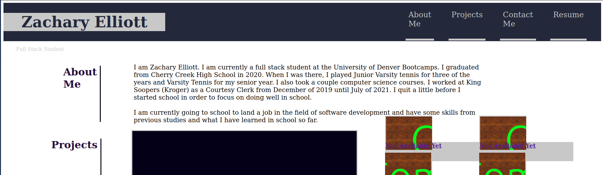

# Zachary Elliott Portfolio
This site is a portfolio for me. It showcases my projects, provides contact information, provides a description about me, and has a link to my resume. The site can be accessed [here.](https://zachary-berdell-elliott.github.io/zachary-elliott-portfolio-site/)

## Navigation
The header includes a navbar that will allow people to navigate to the different sections of the page and a link to my resume.

## About Me Section
This is to provide a brief description about me.

## Projects Section
This section displays my projects. It currently just has placeholders but projects will be added throughout my time in school.

## Contact Section
This includes my contact information and different online profiles.

## Styling
The website is styled in a particular way using the flex property for most of it.

## License
MIT

Copyright 2021 Zachary Elliott

Permission is hereby granted, free of charge, to any person obtaining a copy of this software and associated documentation files (the "Software"), to deal in the Software without restriction, including without limitation the rights to use, copy, modify, merge, publish, distribute, sublicense, and/or sell copies of the Software, and to permit persons to whom the Software is furnished to do so, subject to the following conditions:

The above copyright notice and this permission notice shall be included in all copies or substantial portions of the Software.

THE SOFTWARE IS PROVIDED "AS IS", WITHOUT WARRANTY OF ANY KIND, EXPRESS OR IMPLIED, INCLUDING BUT NOT LIMITED TO THE WARRANTIES OF MERCHANTABILITY, FITNESS FOR A PARTICULAR PURPOSE AND NONINFRINGEMENT. IN NO EVENT SHALL THE AUTHORS OR COPYRIGHT HOLDERS BE LIABLE FOR ANY CLAIM, DAMAGES OR OTHER LIABILITY, WHETHER IN AN ACTION OF CONTRACT, TORT OR OTHERWISE, ARISING FROM, OUT OF OR IN CONNECTION WITH THE SOFTWARE OR THE USE OR OTHER DEALINGS IN THE SOFTWARE.
